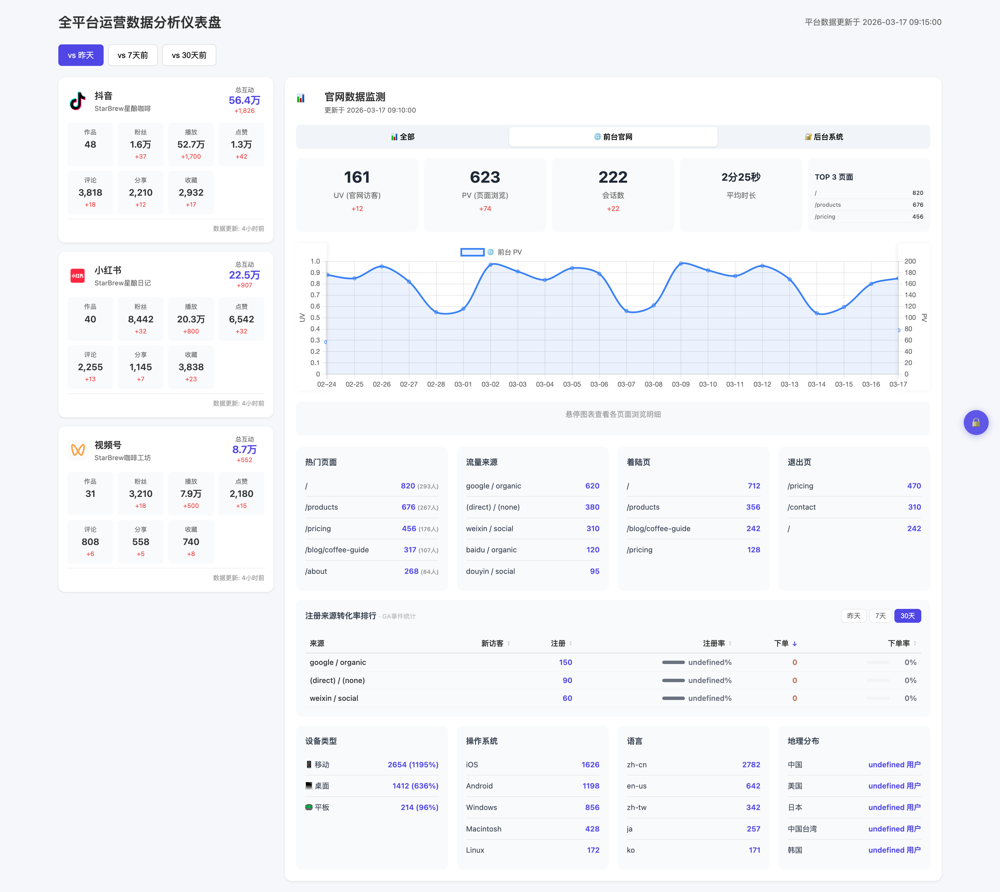

# Creator Data Tracker

一个自动化的全平台运营数据仪表盘。每天自动采集数据，部署到 Vercel，随时查看。

## 仪表盘预览



克隆后运行 `python3 -m http.server 8080`，浏览器打开 http://localhost:8080 ，输入访问码 `888888` 查看虚拟数据示例。

---

## 你提供什么 → 你得到什么

| 你提供 | 你得到 | 是否必选 |
|--------|--------|----------|
| 抖音/小红书创作者后台 Cookie | 粉丝、播放、点赞、评论、分享、收藏的每日自动采集和趋势分析 | 至少选一个平台 |
| 视频号微信扫码（每天一次） | 视频号粉丝、播放、互动数据 | 可选 |
| Google Analytics 服务账号 | 网站流量、来源、用户行为的 GA4 数据面板 | 可选 |
| 后台订单/注册 API 对接 | 订单金额、注册用户、转化率趋势图表 | 可选 |

**最终产出**：一个 Vercel 在线仪表盘，每天自动更新，团队随时查看。

---

## 仪表盘页面组成

### 1. 平台数据卡片（左侧）

每个平台一张卡片：作品数、粉丝、播放、点赞、评论、分享、收藏、总互动。每个指标下方显示增量（vs 昨天/7天前/30天前可切换）。

| 项目 | 说明 |
|------|------|
| 支持平台 | 抖音、小红书、视频号 |
| 数据文件 | `data/all_data.json` |
| 采集方式 | `collect_all.py` 用 Cookie 登录平台后台自动抓取 |
| 自动化 | 抖音/小红书全自动；视频号每天需扫码一次 |

### 2. 官网数据监测（右上）

GA4 网站流量数据，三个 tab：

| Tab | 展示内容 |
|-----|----------|
| **全部** | 注册人数、UV、PV、会话数、平均时长 |
| **前台官网** | 前台网站的 UV/PV/会话 + TOP 3 页面 |
| **后台系统** | 后台应用的 UV/PV/会话 + TOP 3 页面 |

| 项目 | 说明 |
|------|------|
| 数据文件 | `data/ga_data.json` |
| 采集方式 | `scripts/collect_ga.py` 通过 GA Data API 查询 |
| 域名配置 | 在 `collect_ga.py` 中设置 `ALLOWED_HOSTNAMES`、`FRONTEND_HOSTNAMES`、`BACKEND_HOSTNAMES` |
| 自动化 | 全自动 |

### 3. 订单与收入栏

累计订单数、今日新增、累计金额（USD）。

| 项目 | 说明 |
|------|------|
| 数据文件 | `data/orders_data.json` |
| 采集方式 | **不由采集脚本生成**，需要你自己把后台数据推送到仓库 |
| 推送方式 | AI 机器人共创者 / 自写脚本调后台 API / 手动编辑 |
| 不需要？ | 不创建这个文件，仪表盘自动隐藏此区域 |

### 4. 趋势图表

四个 tab 切换：PV/UV 趋势、注册趋势、下单趋势、收起。

| Tab | 数据来源 |
|-----|----------|
| PV/UV | `ga_data.json` → `daily_trend` |
| 注册趋势 | `registration_data.json` 或 `ga_data.json` → `signup_trend` |
| 下单趋势 | `orders_data.json` → `daily` |

### 5. 流量明细（下方表格）

| 表格 | 数据来源 |
|------|----------|
| 热门页面 | `ga_data.json` → `top_pages` |
| 流量来源 | `ga_data.json` → `traffic_sources` |
| 着陆页 / 退出页 | `ga_data.json` → `landing_pages` / `exit_pages` |
| 注册来源转化率 | `ga_data.json` → `signup_by_source_*` |
| 设备 / 系统 / 语言 / 地理 | `ga_data.json` → `devices` / `operating_systems` / `languages` / `geo` |

---

## 数据文件总览

| 文件 | 怎么生成 | 内容 | 必需？ |
|------|----------|------|--------|
| `data/all_data.json` | `collect_all.py` 自动 | 平台粉丝、播放、点赞等 | 是 |
| `data/ga_data.json` | `collect_ga.py` 自动 | GA4 网站流量 | 可选 |
| `data/orders_data.json` | 后台推送 | 订单数、收入金额 | 可选 |
| `data/registration_data.json` | 后台推送 | 每日注册用户数 | 可选 |
| `data/access_code.json` | 手动创建 | 仪表盘 6 位访问码 | 是 |

---

## 数据获取方式

| 数据 | 获取方式 | 自动化程度 |
|------|----------|-----------|
| 抖音 | Cookie + Playwright 抓取 | 全自动（Cookie 约 14 天更新） |
| 小红书 | Cookie + Playwright 抓取 | 全自动（Cookie 约 14 天更新） |
| 视频号 | 微信扫码 + API 抓取 | **每天需扫码**（Cookie 仅几小时） |
| GA 网站流量 | Google Analytics Data API | 全自动 |
| 订单/收入 | 后台 API → 推送到仓库 | 取决于对接方式 |
| 注册用户 | 后台 API → 推送到仓库 | 取决于对接方式 |

---

## 自动化流程

```
每天定时触发（macOS launchd）
    │
    ├── 采集抖音/小红书（全自动）
    ├── 采集视频号（弹窗提醒扫码，2分钟超时）
    ├── 采集 GA 数据（全自动）
    ├── 数据写入 data/*.json + SQLite
    └── git push → Vercel 自动部署 → 仪表盘更新

后台订单/注册数据由机器人或脚本另行推送，同样触发 Vercel 部署。
```

---

## 快速开始

### 1. 克隆并安装

```bash
git clone https://github.com/你的用户名/creator-data-tracker.git
cd creator-data-tracker
python3 -m venv .venv && source .venv/bin/activate
pip install -r requirements.txt
playwright install chromium
```

### 2. 配置

```bash
cp config.example.json config.json
# 编辑 config.json，填入你的平台 Cookie
```

### 3. 运行一次

```bash
python collect_all.py
```

### 4. 设置每日定时采集

```bash
python scripts/setup_cron.py
# 选择每天几点采集（视频号需要你在电脑前扫码）
```

### 5. 部署到 Vercel

1. 推送到你的 GitHub
2. [Vercel](https://vercel.com) 导入仓库，Framework 选 `Other`
3. 之后每次采集完自动推送，仪表盘自动更新

---

## 各模块详细配置

| 模块 | 配置文档 |
|------|----------|
| 抖音/小红书/视频号 | [平台配置](docs/配置文档.md) |
| Google Analytics | [GA 配置指南](docs/GA配置指南.md) |
| 后台业务数据 | [后台数据对接](docs/后台数据对接.md) |

---

## License

MIT
